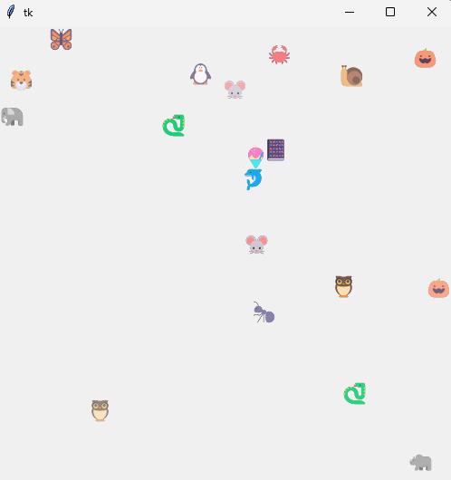

This is a very simple game.  It is intended as an example to illustrate the use of Git and GitHub.

To download the code, open a command window, or a terminal window in VS Code, and enter `git clone https://github.com/NeilStrickland/zoopy.git`.  This should create a subdirectory called `zoopy` containing the files `zoo.py`, `emoji.txt`, `screenshot.png` and `README.md`.

There are various ways you can start the game:
- Open `zoo.py` in VS Code and click the *Run Python File* icon near the top right of the screen, or type Ctrl+F5, or select *Run without debugging* from the *Run* menu.
- Open a command window, or a terminal window in VS Code, move to the `zoopy` directory and enter `python zoo.py`.
Any of these methods should create a new window in which the game will run.  However, sometimes the window is hidden behind VS Code and you need to minimise VS Code or click the relevant icon on the taskbar to make the game active.

Instructions for playing:
- Click anywhere to create a marker at that point, moving in a random direction.
- Type a letter of the alphabet to create the corresponding marker at a random position, moving in a random direction.  Typing 'a' gives you an ant, typing 'b' gives you a butterfly, typing 'c' gives you a camel and so on.
- Type '+' to speed up all existing markers, and '-' to slow them down.
- Type '.' to freeze everything, and '.' again to unfreeze.
- Type '#' to remove all markers.
